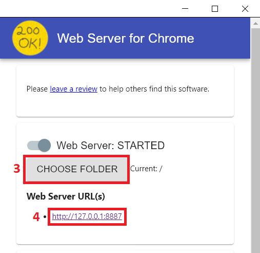

# Friends: The One with the InfoVis - Dashboard

## Project Overview

Drawing inspiration from the iconic TV show "Friends," during the Information Visualization 2021/2022 course we embarked on a journey to design an information-rich dashboard, merging analytical expertise with creative nostalgia in order to provide fans with an engaging experience. By combining HTML, CSS, and JavaScript (including d3.js), the team created an interface that presents data and enables exploration while capturing the essence of the show.

### Technology Stack

The project utilizes the following stack:

- HTML, CSS, JavaScript (d3.js) for frontend development.
- Python (Pandas) for data manipulation and analysis.
- Hitachi’s Pentaho Data Integration & Analytics for data processing and manipulation.
- Microsoft Excel for data exploration and preprocessing.
- LaTeX for comprehensive project documentation.

### Team Members

| Name               | ISTID     |
|--------------------|-----------|
| Catarina Rodrigues | 87817     |
| Daniela Mendes     | 87646     |
| Vasco Pires        | 87708     |

## Getting Started

To run the app on your machine, follow these steps:

### Prerequisites

* Web Server for Chrome - [Install from Chrome Web Store](https://chrome.google.com/webstore/detail/web-server-for-chrome/ofhbbkphhbklhfoeikjpcbhemlocgigb)

or

* Visual Studio Code - [Download](https://code.visualstudio.com/)
* Live Server Extension - [Install](https://marketplace.visualstudio.com/items?itemName=ritwickdey.LiveServer)

### Version 1 - Using Web Server for Chrome Extension

1. Install the *Web Server for Chrome* extension from [Chrome Web Store](https://chrome.google.com/webstore/detail/web-server-for-chrome/ofhbbkphhbklhfoeikjpcbhemlocgigb).
2. Launch the extension
3. Click on the button **CHOOSE FOLDER**, and select the project directory containing *index.html* (root directory).
4. Start the web server and access the provided URL to explore the dashboard.

### Version 2 - Using Visual Studio Code and Live Server Extension

1. Download and unzip the project files from the repository.
2. Install [Visual Studio Code](https://code.visualstudio.com/) if not already installed.
3. Install the [Live Server Extension](https://marketplace.visualstudio.com/items?itemName=ritwickdey.LiveServer) (v5.6.1) in VS Code.
4. Open the project folder in Visual Studio Code.
5. Click the **Go Live** button in the bottom right corner to launch the dashboard.

"Friends: The One with the InfoVis" encapsulates the intersection of data-driven insights and creative entertainment in an interactive dashboard that appeals to fans. The project exemplifies the art of data visualization while offering an immersive journey into the world of "Friends." Thank you for exploring our dashboard tool!
